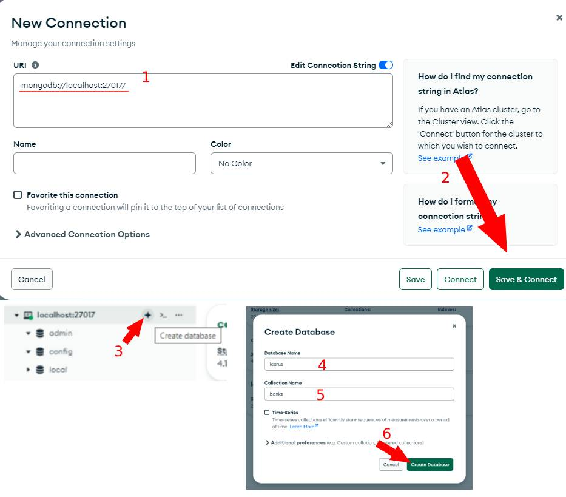

# Table of Contents
- [Requirements](#requirements)
- [Set Up A Test Instance](#setting-up-a-test-instance)
    - [File Explanations](#file-explanations)
- [Contributing](#contributing)
    - [PR Approvals](#pull-request-approvals)

# Requirements
- This guide assumes you are moderately familiar with Discord bots and the Discord API.
- [MongoDB](https://www.mongodb.com/) ***(Version 4 or higher)***
- [Node.js](https://nodejs.org/en/download) ***(Version 20)***

# Setting Up A Test Instance
1. Create a [Discord bot application](https://discord.com/developers/applications). **It must have all privileged intents enabled.** Save the bot token and applicationId in a safe place that you can access later.


2. Invite your bot to the official Icarus test server (Talk to BobbyTheCatfish or the current Bot Owner). Send them your bot invite link. When creating said link, do not add any permissions. They will be assigned via a custom role in the server that is updated based on the real Icarus's permissions. 
3. Clone the repository. If you're using Github Desktop, you can follow the below instructions. Otherwise do
```
git clone https://github.com/LDS-Gamers-Studios/icarus5.5.git
```


4. Create a [local database](https://www.mongodb.com/try/download/community), or try the cloud based [Atlas Shared Tier](https://www.mongodb.com/cloud/atlas/register). For the sake of this tutorial, I will be using the local version.

If you use the cloud version, the M0 Free Tier meets all the requirements. Please note that your connection string will have `+srv` near the start. Make sure to include this when we come back to the database later.


Instructions for local installation
-   1. Download the [community version of MongoDB](https://www.mongodb.com/try/download/community#:~:text=Package-,Download,-Copy%20link). The latest version *should* be fine.
    2. In the installation, select `Complete Installation`, and `Run service as a Network Service user`.
    3. If you haven't already installed Mongo Compass, there's an option to download it on the next screen.
    4. When you finish the installation, go into Mongo Compass and use the following connection string: `mongodb://localhost:27017/`
    5. Create a new database called `icarus`, and a collection called `bank`. This will act as a base to start, and Icarus should be able to create new collections and records on its own.
    
5. Create the following files, based on their matching `-example` file:
- `config/config.json`
- `config/snowflake-testing-commands.json`
- `data/banned.json`

Explanations of these files can be found in the [File Explanations section](#file-explanations).

6. Within the root folder of the repo, run `npm ci` to install the dependencies.
7. Run `node register-commands.js` to register all of the interaction commands with the Discord API.
8. Start the bot by running `node .`

## File Explanations
For the bot to successfully run, you'll need to edit your configuration file first. This file, for obvious security reasons, are excluded from the repository. However, an example file is provided to make setup easier.

### `config/config.json`

**NOTE: THIS SECTION MIGHT NOT BE UP TO DATE, so please refer to `config-example.json`**

(Just as a general rule of thumb, if there's a placeholder string you should probably change it to the correct value.)
- `ownerId`: set to your ID. To get IDs easily, turn on Developer mode in Discord by going to Settings > Advanced > Developer Mode
- `adminId`: put your ID in there.
- `api`: These are API keys for certain commands. They aren't required, but some commands will break without them. Instructions for obtaining these keys are in the example file.
- `applicationId`: The applicationId you took note of during bot creation
- `db`: This is the connection info for Mongo. Recall the connection string you noted down earlier.

The general format of a connection string is `<service><username?>:<password?>@<connection>`

If you're using the cloud version, the format is `<mongodb+srv://><username>:<password>@<connection>`.

If you're running locally, `<connection>` it will be `<mongodb://><username>:<password>@<localhost:27017>`. If you didn't set up a username and password, leave those parts as empty strings.
- - `db.db`: `<service><connection>/icarus`
- - `db.settings.user`: the `<username>` part of the string.
- - `db.settings.pass`: the `<password>` part of the string.
- `silentMode` You can turn this on if you're repeatedly restarting the bot in order to skip sending startup messages
- `siteOn`: Leave as false unless you're testing things with the backend
- `webhooks`: URLs to different webhooks.
- - `webhooks.errors`: This is what error logs are sent through. You'll get one upon getting your bot in the server.
- - `webhooks.watchlist`: The link for this is pinned in the [#watch-list channel](https://discord.com/channels/1207046241540640798)
- `google`: information for the Google API. You can obtain API credentials [here](https://console.cloud.google.com/apis/library/sheets.googleapis.com). IDs for the testing sheets can be found in the [#info](https://discord.com/channels/1207041599608061962) channel.
- `prefix`: Change this to a unique character.
- `token`: The bot's token for login that you copied earlier.

## Other Files
### `data/banned.json`
This contains words that trigger an auto-mute when someone says one of them. The provided example can be copied without modification.

### `config/snowflakes-testing-commands.json`
This contains the IDs of the slash and context commands. The provided example can be copied without modification. It will be automatically filled out when you run `node register-commands.js`.

# Contributing

## Software
Use of the following software is recommended to make contributions easier.
- [Github Desktop](https://desktop.github.com/) to make Git easier
- [VSCode](https://code.visualstudio.com/) for an IDE/text editor
- [ESLint Plugin for VSC](https://marketplace.visualstudio.com/items?itemName=dbaeumer.vscode-eslint) (if you choose a different IDE, you should find an extension for ESLint and the typescript server)
- [MongoDB Compass](https://www.mongodb.com/products/tools/compass) to make viewing DB entries easier

## Code Quality
To ensure the quality of the code we upload to the repo, two safeguards are currently in place.

### ESLint
ESLint is a JavaScript plugin that checks all the javascript files for [linting issues](https://stackoverflow.com/a/30339671)
A pull request must have 0 linting issues in order to be approved. There are automatic checks in place to enforce this. Plugins such as the before mentioned one for VSC allow you to see these errors in your code editor and are highly recommended.

### // @ts-check
Welcome to the wonderful but also frustrating world of typescript-check. Javascript is what's known as a [weakly  typed language](https://www.linkedin.com/advice/0/what-difference-between-strongly-weakly-typed-eqwlc#:~:text=Sign%20in-,Last%20updated%20on%20Mar%2019%2C%202024,What%20is%20weak%20typing%3F,-Weak%20typing%20means). Typescript, on the other hand, is a form of javascript that enforces types. This prevents a lot of silly errors such as passing the wrong variable into a function, getting undefined properties (ie: foo.bob when you meant foo.bar), and so on. 

Typescript is actually already running in the background when you work on javascript code, especially in VSC. It's the whole reason intellisense (or the variable suggestions) works. So what's `// @ts-check`? While the typescript server provides variables in normal JS files, it's usually not able to tell you if you've made any type errors. // @ts-check, mixed with JSDoc (which allows you to assign types to variables) allows it to display type errors in the document, showing potential mistakes. You can find more information [here](https://www.typescriptlang.org/docs/handbook/intro-to-js-ts.html).

BobbyTheCatfish knows his way around this pretty well, so reach out to him if you're having to do weird things to clear errors, or if you're wondering if there's a better way to do something.

## Pull Request Approvals
In order for a pull request to be approved, the following requirements have to be met:
- All changes have been tested on both your and the reviewer's instances of Icarus and all features and branches are confirmed working. Note for reviewers: make sure to `npm ci` and restart your code editor so you don't get any caching issues before testing.
- A quick look through by both parties of all modified files to see if any features should behave differently
- All user seen strings need to be LDSG-Worthy
- All changes to `config.json` (new properties, changed defaults, etc) need to be reflected in `config/config-example.json` with a description if possible
- All IDs (snowflakes) need to be put in `config/snowflakes.json` (real server IDs) and `config/snowflakes-testing.json` (testing server IDs).
- All interactions that need registration must follow the style of the existing files in `/registry`
- All functions must have sufficient valid JSDoc describing the types of parameters, as well as the return type if really needed. This includes variables like `Collections` and `Array`s, which by default are typed to contain `any` or `never` unless an initial value is passed in.
- All new dependencies should be reflected in `package.json` and `package-lock.json`
- No @ts-check errors (message the Bot Owner if you're having trouble)
- No ESLint errors
