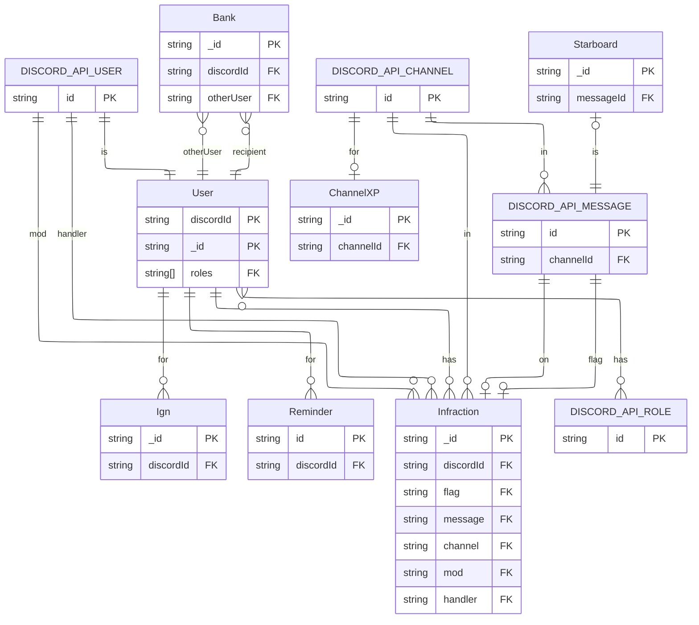

This diagram only covers primary and foreign keys as to avoid degradation after updates to the model properties

```mermaid
---
config:
    layout: elk
---
erDiagram
DISCORD_API_USER ||--|| User : is

User ||--o{ Bank : recipient
Bank }o--|| User : otherUser
User ||--o{ Ign : for
User ||--o{ Reminder : for
User ||--o{ Infraction : has
User }o--o{ DISCORD_API_ROLE : has

DISCORD_API_USER ||--o{ Infraction : mod
DISCORD_API_USER ||--o{ Infraction : handler

DISCORD_API_CHANNEL ||--o| ChannelXP : for
DISCORD_API_CHANNEL ||--o{ DISCORD_API_MESSAGE : in
DISCORD_API_MESSAGE ||--o| Infraction : on
DISCORD_API_MESSAGE ||--o| Infraction : flag
DISCORD_API_CHANNEL ||--o{ Infraction : in

Starboard |o--|| DISCORD_API_MESSAGE : is

User {
  string discordId PK
  string _id PK
  string[] roles FK
}

Bank {
  string _id PK
  string discordId FK
  string otherUser FK
}

Ign {
  string _id PK
  string discordId FK
}

Infraction {
  string _id PK
  string discordId FK
  string flag FK
  string message FK
  string channel FK
  string mod FK
  string handler FK
}

Reminder {
  string id PK
  string discordId FK
}

ChannelXP {
  string _id PK
  string channelId FK
}

Starboard {
  string _id PK
  string messageId FK
}

DISCORD_API_USER {
  string id PK
}

DISCORD_API_MESSAGE {
  string id PK
  string channelId FK
}

DISCORD_API_CHANNEL {
  string id PK
}

DISCORD_API_ROLE {
  string id PK
}

```